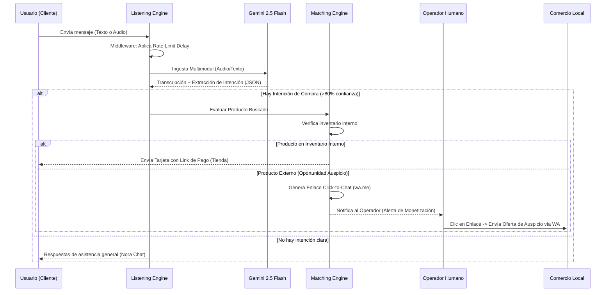

# Memoria Técnica Descriptiva - Sistema "Nora Pro"

**Título de la Obra:** Sistema Agente de Inteligencia Artificial Multimodal y Comercial "Nora Pro".
**Naturaleza del Software:** Plataforma de redacción periodística automatizada, distribución social y motor de emparejamiento comercial (Matching Engine) impulsado por Modelos de Lenguaje Grande (LLMs).

## 1. Descripción Técnica Explicativa

El sistema "Nora Pro" constituye un ecosistema de software modular diseñado para operar sobre el portal digital "Nexativa News". Su arquitectura de "cero ruptura" (desacoplada del núcleo transaccional estable) le permite funcionar de forma asíncrona y segura. 

Las capacidades técnicas principales se dividen en dos ejes:

**A. Pipeline Periodístico y Distribución (Social Distributor):**
El sistema incorpora módulos de ingesta automatizada que procesan fuentes RSS de noticias nacionales y provinciales. Mediante algoritmos de procesamiento de lenguaje natural, el contenido se filtra, reescribe con un tono hiperlocal y optimiza para motores de búsqueda (SEO) inyectándose directamente en un CMS headless (Supabase). Posteriormente, un webhook estructurado genera un feed RSS (`/feeds/noticias-pro.xml`) con etiquetas personalizadas (`<nora:x_thread>`, `<nora:wa_alert>`), listo para integrarse en herramientas de automatización sin código (No-Code) que distribuyen el contenido en redes sociales sin uso de APIs pagas.

**B. Motor de Escucha Omnicanal (Listening Engine):**
Funciona como el núcleo comercial de la plataforma. Recibe inputs de texto o audio (multimodal) por parte de los usuarios. Utilizando la API de Google AI Studio (modelo Gemini 2.5 Flash), el sistema realiza la transcripción de audio a texto y la inferencia de intenciones de compra simultáneamente, optimizando latencia y consumo de tokens. Cuando se detecta una intención comercial legítima, el "Matching Engine" compara la solicitud con el inventario interno. Si es un requerimiento externo, genera automáticamente un enlace transaccional de redirección manual "Click-to-Chat" (`wa.me/...`) para que un operador humano notifique al comerciante local la oportunidad de negocio.

Todo el ecosistema incluye un middleware defensivo de control de flujo (Rate Limiting Delay) para respetar cuotas de servicio de infraestructura en la capa gratuita y garantizar alta disponibilidad.

## 2. Diagrama de Flujo (Motor de Escucha y Monetización)

